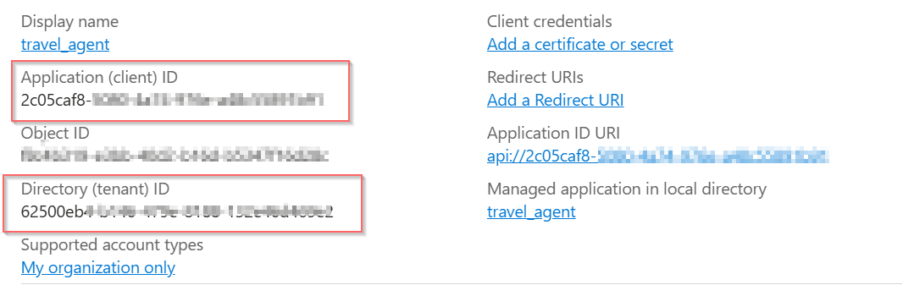
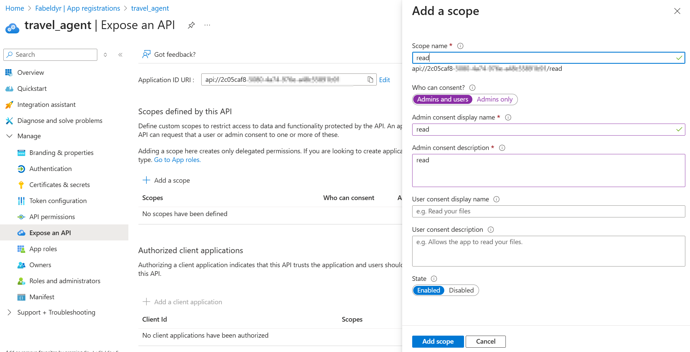
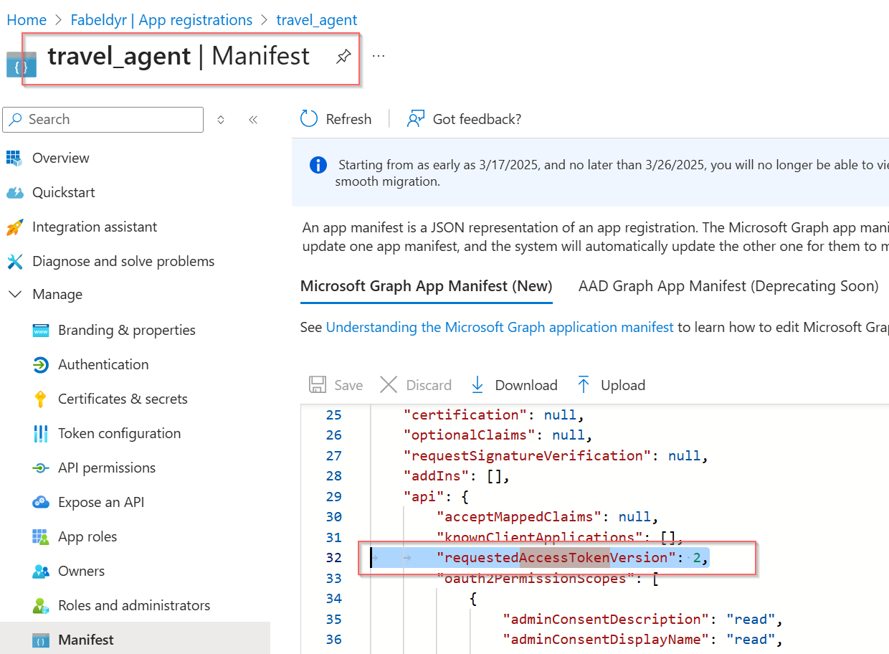
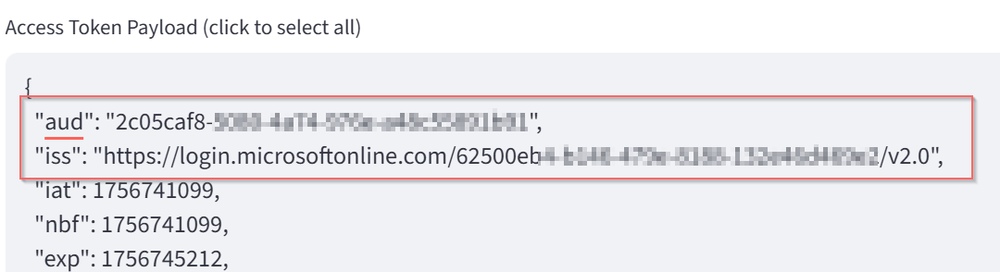
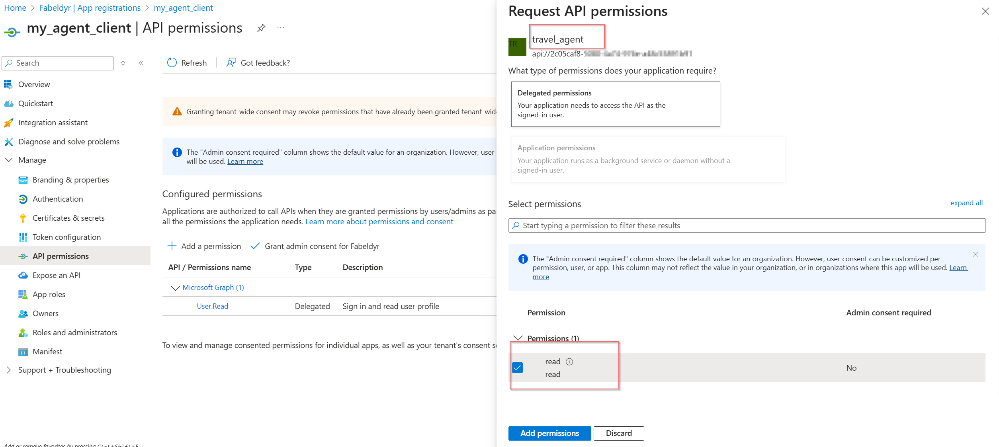

# 02. Agent With EntraID Inbound Authentication

## Overview

This example shows how to how to do Agent inbound authentication with Entra ID.

## AgentCore Document and User Guide
- https://github.com/awslabs/amazon-bedrock-agentcore-samples/blob/main/01-tutorials/03-AgentCore-identity/03-Inbound%20Auth%20example/inbound_auth_runtime_with_strands_and_bedrock_models.ipynb
- https://docs.aws.amazon.com/bedrock-agentcore/latest/devguide/identity-idp-microsoft.html

## 1. Prerequisite: Entra ID setup

### 1.1 Create application registration for Agent
1. Go to Entra ID → App registrations → New registration.
2. Name it something **travel_agent**.
3. Set the Supported account types (e.g. Single tenant for testing).

4. After it’s created:
- Take notes of Entra Tenant ID 
- Take notes of Entra Application (client) ID
5. Create Scope
- Go to **Expose an API** → Click Set for Application ID URI (it’ll look like api://<client-id> by default).
- Click Add a scope:
   - Name: read
   - Who can consent: Admins and users
- Now you have a scope: "api://<client-id>/read"


### 1.2 IMPORTANT: Force EntraID to use OAuth V2 endpoint
During the Oauth flow, the EntraID might issue access token with ver 1 style, where the iss is "https://sts.windows.net/<tenant_id>/"
```json
{
  "aud": "api://<agent_client_id>",
  "iss": "https://sts.windows.net/<tenant_id>/",
}
```

But we need the version 2 style as below
```json
{
  "aud": "<agent_client_id>",
  "iss": "https://login.microsoftonline.com/<tenant_id>/v2.0"
}
```

To force Entra Id to use V2 enpoint, you have to 
1. Go to Azure Portal → App registrations → Find your **travel_agent** app
2. Go to Manifest
3. Find **accessTokenAcceptedVersion** and change it from null (or 1) to 2:



You can read more about it at [here](https://learn.microsoft.com/en-us/entra/identity-platform/access-tokens#token-formats), [here](https://learn.microsoft.com/en-us/entra/identity-platform/reference-app-manifest#accesstokenacceptedversion-attribute) and [here](https://learn.microsoft.com/en-us/entra/identity-platform/reference-microsoft-graph-app-manifest) 

After this, we will get correct access token in the format that we need:



### 1.3 Create application registration for Agent Client (a streamlit app)
This is the app that will request a token to call your Agent.
1. Register another app in Entra ID → call it **my_agent_client**.
2. Add a redirect URI (http://localhost:8501 for Streamlit).
3. *NOT NEED* Under API permissions, click Add a permission → My APIs → **travel_agent** → Delegated permissions → **read**. 
Grant admin consent.

4. Create application secrete 
5. Create Web Redirect URL for local streamlit app: http://localhost:8501


## 2. Reuse the agent application code as before
the agent file is identical as [travel_agent_standalone.py](./travel_agent_standalone.py)

## 3. Create deployment script
[Deployment script](./scripts/deploy_agent.py)

## 4. Build and Deploy to AWS

1. **Setup Environment Variables**
   ```bash
   # Copy the example file and update with your values
   cp .env.example .env
   # Edit .env file with your Entra ID configuration
   ```

2. **Build and Deploy Agent**
   ```bash
   # Build and deploy agent
   python ./scripts/deploy_agent.py
   # The deployed agent ARN is automatically saved to .env file
   ```

## 5. End User Authentication and Invoke the agent 

### Streamlit App - Using Authentication Code Flow
```bash
# Run the Streamlit chat application (environment variables loaded automatically)
streamlit run client_app/app.py
```


## Valid Access Token JWT Example
```json
{
  "aud": "2c05caf8-.....",
  "iss": "https://login.microsoftonline.com/[ENTRA_TENANT_ID]/v2.0",
  "email": "EXAMPLE@ABCDEFG.onmicrosoft.com",
  "name": "Feng Lu",
  "preferred_username": "EXAMPLE@ABCDEFG.onmicrosoft.com",
  "ver": "2.0"
  ...
}
```