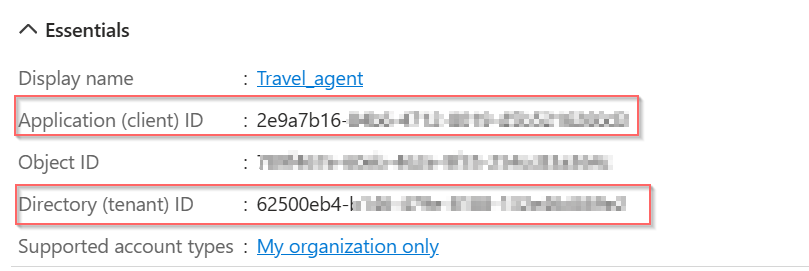

# 02. agent_authN_end_users

## Overview

This example shows how to how to do Agent inbound authentication with Entra ID.

## Entra ID setup
- Create an application in Entra ID
- Take notes of Entra Tenent ID 
- Take notes of Entra Application (client) ID

**TODO (more config steps?)**




## AgentCore Document and User Guide
- https://github.com/awslabs/amazon-bedrock-agentcore-samples/blob/main/01-tutorials/03-AgentCore-identity/03-Inbound%20Auth%20example/inbound_auth_runtime_with_strands_and_bedrock_models.ipynb
- https://docs.aws.amazon.com/bedrock-agentcore/latest/devguide/identity-idp-microsoft.html

## 2. Create the app file of your agent
Create a simple agent [travel_agent_authN_end_users.py](./travel_agent_authN_end_users.py)

## 3. Create deployment script
[Deployment script](./scripts/deploy_agent.py)

## 4. Build and Deploy to AWS
```bash
# setup env variables
export AWS_REGION=eu-central-1
export ENTRA_TENANT_ID=[Entra Tenant ID]
export ENTRA_AUDIENCE=[Entra Application (client) ID]
export ENTRA_DISCOVERY_URL=https://login.microsoftonline.com/${ENTRA_TENANT_ID}/v2.0/.well-known/openid-configuration

python ./scripts/deploy_agent.py
```

## 5. End User Authentication and Invoke the agent 
 
```bash
# 1. Use Device Code flow to get bearer token from Entra ID  
python ./scripts/user_auth.py
# Now the auth code is saved to .auth_token file

# 2. Load the token value and invoke the agent 
source .auth_token
python ./scripts/invoke_agent.py
```


## JWT Example
```json
{
  "aud": "2e9a7b16-.....",
  "iss": "https://login.microsoftonline.com/[ENTRA_TENANT_ID]/v2.0",
  "email": "EXAMPLE@ABCDEFG.onmicrosoft.com",
  "name": "Feng Lu",
  "preferred_username": "EXAMPLE@ABCDEFG.onmicrosoft.com",
  "ver": "2.0"
  ...
}
```