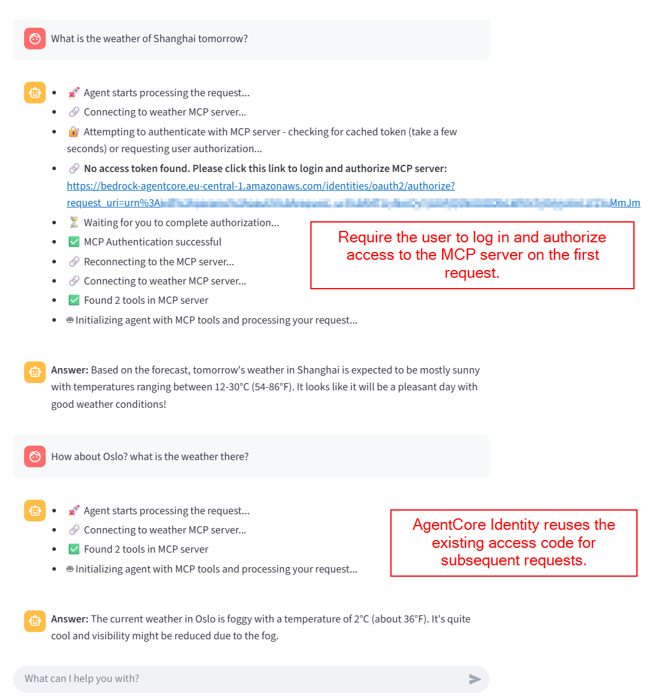
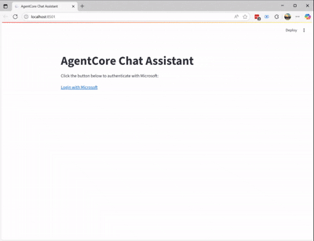

# 04. Connect Agent with MCP Server with 3LO Outbound Authentication

This example demonstrates how to connect an agent with an MCP server, using Entra ID for both inbound and outbound (3LO) authentication. Both the agent and the mcp server are hosted in AgentCore Runtime.

## 1. What We're Building

We'll create a new version of the travel agent. Instead of including tools inside the agent, it connects to the weather MCP server created in [03. Host MCP Server with AgentCore Runtime](../03_host_mcp_server/). 

**Prerequisites:** Deploy the weather MCP server from Example 03 first. 

## 2. Architecture


```markdown
Note:
- Tenant A: Used for Travel Agent Inbound Authentication
- Tenant B: Used for:
  - Travel Agent Outbound Authentication 
  - Weather MCP Inbound Authentication

For simplicity, this example uses the same Entra ID tenant for both Tenant A and Tenant B.
```

## 3. Create AgentCore Identity Provider

Before starting, we need to create an identity provider in AgentCore Identity. This provider handles user authentication (3LO) when the agent makes outbound calls to the MCP server.

This example uses Entra ID as the identity provider.  

### 3.1 Create Entra ID App Registration for OAuth Access Tokens

1. **Navigate to Entra ID portal** → App registrations → New registration
2. **Application name:** `mcp_tenant_3LO` (configure as multi-tenant application)
3. **Add redirect URI:** `https://bedrock-agentcore.eu-central-1.amazonaws.com/identities/oauth2/callback` (We are using AWS region `eu-central-1`)
4. **Create client secret** for the application

### 3.2 Create AgentCore Identity Provider

**Provider Name:** `fabeldyr-entra-mcp-provider`

You can either:
- Manually create the Entra ID identity provider in AgentCore Console, or
- Use the automated script:

```bash
# Set environment variables from step 3.1
# Update the mcp_tenant_3LO info in .env file or set environment variables manually as following
export MCP_TENANT_3LO_CLIENT_ID=[mcp_tenant_3LO_client_id]
export MCP_TENANT_3LO_SECRET=[mcp_tenant_3LO_secret]

# Create the Entra ID provider in AgentCore Identity
python ./scripts/setup_oauth_provider.py
```

## 4. Create and Deploy New Version of Travel Agent

The new travel agent implementation is available in [travel_agent_calls_mcp.py](./travel_agent_calls_mcp.py).

```bash
# Copy the example configuration file
cp weather_mcp.sample.json weather_mcp.json
# Update the values with your weather MCP server details from Example 03

# Build and deploy the agent
python ./scripts/deploy_agent.py
# The deployed agent ARN is automatically saved to the .env file
```

## 5. Set Up Streamlit App for MCP Authentication Logs

### 5.1 Register Streamlit App in Entra ID

This app will request tokens to call your agent.

1. **Register a new app** in Entra ID named `chat_app_for_mcp`
2. **Add redirect URI:** `http://localhost:8501` (for local Streamlit development)
3. **Create application secret**
4. **Configure web redirect URL:** `http://localhost:8501`

### 5.2 Run the Streamlit App

```bash
# Update the Streamlit client credentials in .env file or set environment variables manually as following
export STREAMLIT_ENTRA_CLIENT_ID=[YOUR_STREAMLIT_CLIENT_ID]
export STREAMLIT_ENTRA_CLIENT_SECRET=[YOUR_STREAMLIT_CLIENT_SECRET]

# Run the client application
streamlit run client_app/app.py

# Open your browser to http://localhost:8501
```

## 6. Demo



The screenshot demonstrates:
1. **First request:** Requires end-user login to authorize the agent's access to the OAuth-protected MCP server
2. **Second request:** No login required as AgentCore Identity caches the access token from the previous request

### 6.1 Demo Video



[Down demo (webm)](./doc/demo.webm)